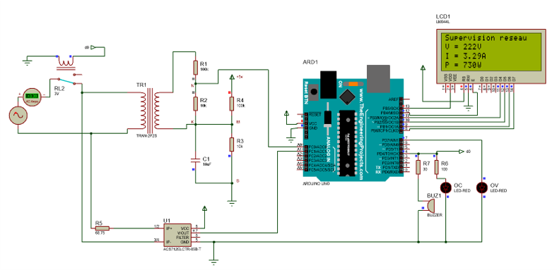
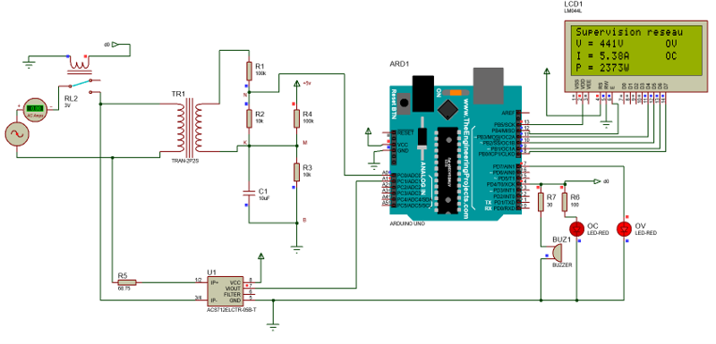

# Home Electrical Protection & Supervision (Proteus Simulation)

A circuit-level design and simulation for real-time AC voltage/current 
monitoring with automatic overload protection, built and verified in 
**Proteus** (`homeprotectionsupervisionV2.pdsprj`).

> **Note:** This is a simulation/circuit-design project, not a built 
> physical device. It demonstrates the sensing, threshold-detection, and 
> protection logic at the schematic level, verified through Proteus's 
> simulated fault injection rather than on physical hardware.

## What It Does

Monitors AC voltage and current in real time and reacts to two fault 
conditions — overvoltage (OV) and overcurrent (OC) — with both a local 
alert (LCD, LED, buzzer) and an automatic protective action (relay 
disconnects the load).

## System Architecture

```
Voltage: AC line → Step-down transformer (TR1) → Voltage divider (R1-R4) → RC filter (C1) → Arduino A0
Current: AC line → ACS712 Hall-effect sensor (U1) → Arduino A1
                              │
                    RMS calculation (V, I, P)
                              │
                  Compare against OV/OC thresholds
                    ┌─────────┴─────────┐
                Normal                Fault
                  │                     │
          LCD shows V/I/P      LED (OC/OV) + buzzer alert
                              Relay (RL2) disconnects load
```

## Hardware (as simulated)

| Component | Role |
|---|---|
| Arduino UNO | Processing + decision logic |
| ACS712 (U1) | AC current sensing (Hall-effect) |
| Transformer (TR1) + voltage divider (R1-R4) + RC filter (C1) | AC voltage sensing, scaled and smoothed for ADC |
| 16x2 LCD | Live voltage/current/power display |
| LEDs (OC, OV) + buzzer | Fault indicators |
| Relay (RL2) | Automatic load disconnection on fault |

## Fault Handling

- **Overvoltage / overcurrent detection**: RMS voltage and current are 
  computed from sampled ADC readings and compared against fixed safety 
  thresholds.
- **Relay trip**: on either fault, the relay opens to disconnect the load 
  before alerting — protection takes priority over notification, since a 
  buzzer with no reaction is worthless if the hardware is already at risk.

## Simulated Verification

**Normal operation** — system idle, no faults:



`V = 222V, I = 3.29A, P = 730W` — nominal household-range values, no OC/OV flags raised.

**Fault condition** — simulated overvoltage + overcurrent injected simultaneously:



`V = 441V, I = 5.38A, P = 2373W` — both OC and OV flags trigger on the LCD, 
relay opens to disconnect the load, LEDs and buzzer activate.

## Limitations & Next Steps

- Not yet built on physical hardware — real-world ADC noise, transformer 
  ripple, and relay switching transients aren't captured by the simulation
- No datalogging or remote monitoring — planned future direction if this 
  moves to a physical build
- Fixed thresholds only — no calibration routine for different installations
- Only tested with OC and OV triggered together — worth simulating each 
  fault independently to confirm isolated detection logic

## Stack

Arduino UNO, ACS712, Proteus (schematic capture + simulation)
